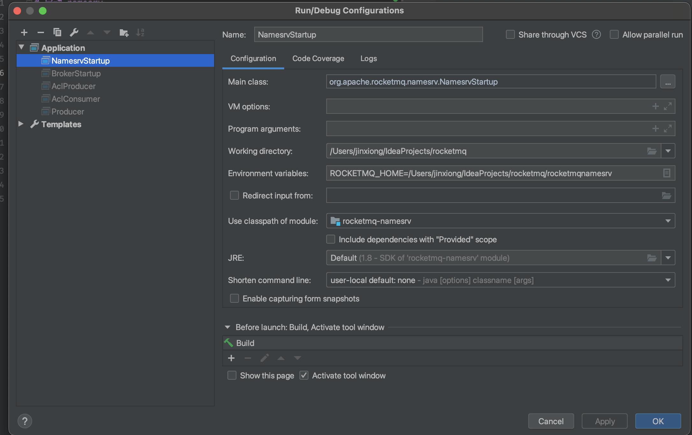
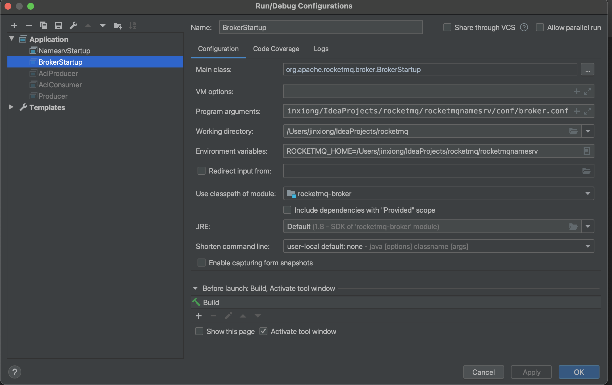

# 启动 namesrv
启动类
`org.apache.rocketmq.namesrv.NamesrvStartup`
环境变量
ROCKETMQ_HOME=/Users/jinxiong/IdeaProjects/rocketmq/rocketmqnamesrv

# 启动 broker
启动类
`org.apache.rocketmq.broker.BrokerStartup`
环境变量
ROCKETMQ_HOME=/Users/jinxiong/IdeaProjects/rocketmq/rocketmqnamesrv
启动参数
`-c /Users/jinxiong/IdeaProjects/rocketmq/rocketmqnamesrv/conf/broker.conf`

